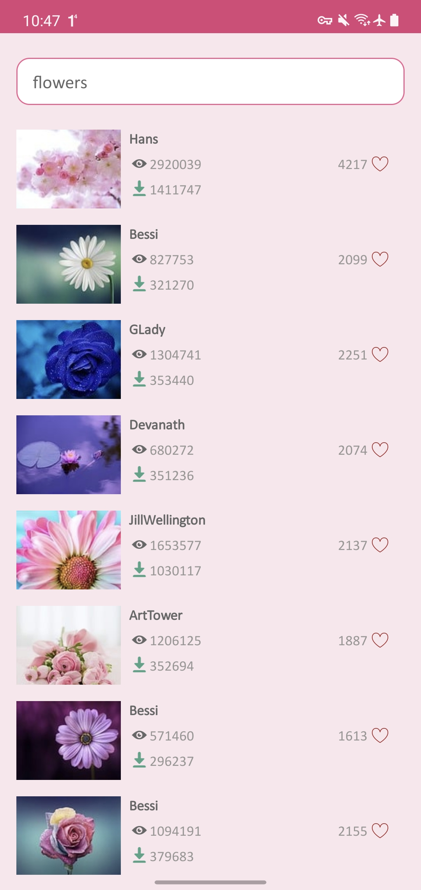

# Pixabay App

## General
Android Studio 4.2.2 and Java 8 were used to build this app.
This app is for android devices

## Structure

Structure may be a little verbose for this app. However scalability 
has been considered for future development.

This app was built around clean architecture with MVVM and repository pattern.

## Backend

[Weather Api](https://pixabay.com/api/docs/#api_search_images) api is consumed for the backend.

